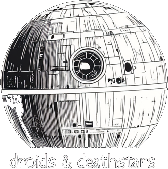

A responsive web application built with React and Tailwind CSS to explore species and classes in the Star Wars 5e (SW5e) universe, based on the Star Wars Fifth Edition tabletop RPG. Browse detailed information about species, classes, and their archetypes, with a mobile-friendly interface and interactive modals.

Live Demo: [https://droids-and-deathstars.netlify.app](https://droids-and-deathstars.netlify.app)

## Features

- **Species and Classes Browser**: View a grid of SW5e species (e.g., Aqualish, Human) and classes (e.g., Berserker, Consular) with images and names.
- **Search Functionality**: Filter species or classes by name using a search bar.
- **Interactive Modals**: Click a species or class to open a modal with tabs for details (e.g., description, traits, proficiencies).
- **Archetypes (Subclasses)**: For classes, a purple "Subclasses" button displays a list of archetypes (e.g., Way of Balance for Consular, Acquisitions Practice for Engineer), with detailed views for each.
- **Responsive Design**: Optimized for both desktop and mobile devices, with a single-column grid and stacked modal layout on mobile (<640px).
- **Data-Driven**: Pulls data from `species.js`, `classes.js`, and `subclasses.js`, supporting 40 archetypes and multiple species.
- **External Resources**: Images hosted on `starwars5ecentral.blob.core.windows.net`, with archetype data sourced from [sw5e.com](https://www.sw5e.com/characters/archetypes).

## Tech Stack

- **Frontend**: React (18.2.0) with JSX, rendered via CDN (`react.production.min.js`, `react-dom.production.min.js`).
- **Styling**: Tailwind CSS (CDN) for responsive layouts and utility classes.
- **Transpilation**: Babel (7.22.9) for JSX support (`babel.min.js`).
- **Hosting**: Deployed on Netlify at [https://droids-and-deathstars.netlify.app](https://droids-and-deathstars.netlify.app).
- **Data**: JavaScript files (`species.js`, `classes.js`, `subclasses.js`) for static data, no backend required.

## Setup Instructions

### Prerequisites
- A modern web browser (e.g., Chrome, Firefox).
- A text editor (e.g., VS Code).
- Node.js (optional, for local development with a live server).
- Git (for cloning the repository).

### Installation
1. **Clone the Repository**:
   ```bash
   git clone https://github.com/your-username/droids-and-deathstars.git
   cd droids-and-deathstars
   ```
   *Note*: Replace `your-username` with the actual repository owner if hosted on GitHub.

2. **Directory Structure**:
   Ensure the following files are present:
   ```
   /droids-and-deathstars
   ├── index.html
   ├── species.js
   ├── classes.js
   ├── subclasses.js
   └── assets/
       └── dnd_logo.png
   ```

3. **Serve Locally**:
   - Option 1: Use a simple HTTP server (requires Node.js):
     ```bash
     npm install -g http-server
     http-server .
     ```
     Open `http://localhost:8080` in your browser.
   - Option 2: Open `index.html` directly in a browser (may have CORS issues with local file loading).

4. **Verify Dependencies**:
   - `index.html` loads external scripts via CDN:
     - React: `https://cdn.jsdelivr.net/npm/react@18.2.0/umd/react.production.min.js`
     - React DOM: `https://cdn.jsdelivr.net/npm/react-dom@18.2.0/umd/react-dom.production.min.js`
     - Babel: `https://cdn.jsdelivr.net/npm/@babel/standalone@7.22.9/babel.min.js`
     - Tailwind CSS: `https://cdn.tailwindcss.com`
   - Ensure internet access for CDN resources.

### File Descriptions
- **`index.html`**: Main application file, containing React components (`App`, `Card`, `Modal`, `SubclassList`, `SubclassDetail`) and Tailwind styles. Renders the UI and handles modals, search, and navigation.
- **`species.js`**: Defines species data (e.g., Aqualish, Human) with fields like `name`, `image`, `description`, `traits`, and `abilityScoreIncrease`.
- **`classes.js`**: Defines class data (e.g., Berserker, Consular) with fields like `name`, `image`, `description`, `hitDice`, and `proficiencies`.
- **`subclasses.js`**: Defines 40 archetypes (e.g., Way of Balance, Acquisitions Practice) with `className`, `name`, `description`, and `features` (level 3 abilities).
- **`assets/dnd_logo.png`**: Logo image for the header.

## Deployment

The app is currently deployed on Netlify at [https://droids-and-deathstars.netlify.app](https://droids-and-deathstars.netlify.app).

### Deploying to Netlify
1. Push the project to a GitHub repository.
2. Log in to [Netlify](https://www.netlify.com) and select "New site from Git."
3. Connect your GitHub repository and configure:
   - Build command: None (static site).
   - Publish directory: `/` (root).
4. Deploy the site. Netlify will serve `index.html` and associated files.
5. Ensure `assets/dnd_logo.png` and data files (`species.js`, `classes.js`, `subclasses.js`) are included in the repository.

### Notes
- Images in `species.js` and `classes.js` (e.g., `https://starwars5ecentral.blob.core.windows.net/site-images/...`) are hosted externally. Verify their availability.
- If images fail to load, update URLs in `species.js` and `classes.js` or host images locally in `/assets`.

## Usage

1. **Home Page**:
   - View the header with the "Droids & Deathstars" logo and title.
   - Use the navigation bar to toggle between "Species" and "Classes."
   - Enter a search query to filter items (e.g., "Human" for species, "Berserker" for classes).

2. **Grid View**:
   - Browse cards displaying species or classes with images and names.
   - Click a card to open a modal with detailed information.

3. **Modal**:
   - View tabs for details (e.g., Description, Traits, Proficiencies).
   - For classes, click the purple "Subclasses" button to see archetypes (e.g., 5 for Engineer, 4 for Consular).
   - Click an archetype to view its description and level 3 features, with a back arrow to return to the list.
   - Close the modal with the red "Close" button.

4. **Responsive Design**:
   - On desktop (≥640px): Multi-column grid, side-by-side modal layout, larger fonts.
   - On mobile (<640px): Single-column grid, stacked modal layout, smaller fonts, touch-friendly buttons.

## Contributing

Contributions are welcome! To contribute:
1. Fork the repository.
2. Create a feature branch:
   ```bash
   git checkout -b feature/your-feature
   ```
3. Make changes (e.g., add species, archetypes, or UI enhancements).
4. Commit and push:
   ```bash
   git commit -m "Add your feature"
   git push origin feature/your-feature
   ```
5. Open a pull request with a description of changes.

### Suggested Improvements
- Add a search bar within the archetype list for filtering.
- Include archetype images in `subclasses.js` and update `SubclassList`/`SubclassDetail` to display them.
- Implement a "No results" message for the main search bar.
- Add higher-level archetype features (e.g., level 7, 10) in `subclasses.js`.
- Enhance mobile UX with a full-screen modal toggle or gestures.

## License

This project is unlicensed and free to use. Data is sourced from [Star Wars 5e](https://www.sw5e.com) under their respective terms.

## Acknowledgments

- [Star Wars 5e](https://www.sw5e.com) for class, species, and archetype data.
- [Netlify](https://www.netlify.com) for hosting.
- Community resources for SW5e mechanics and insights.

For issues or feature requests, open an issue on the GitHub repository or contact the maintainer.
